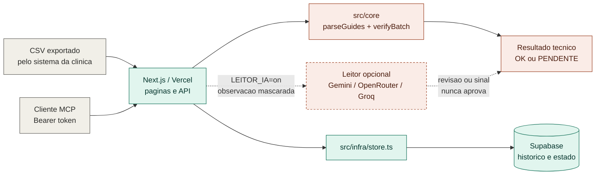
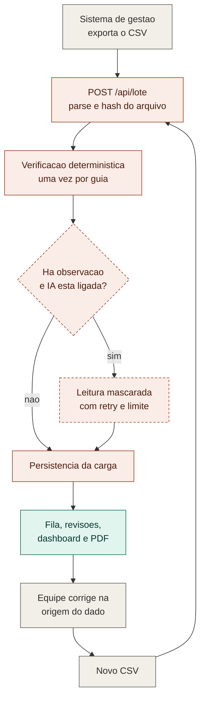
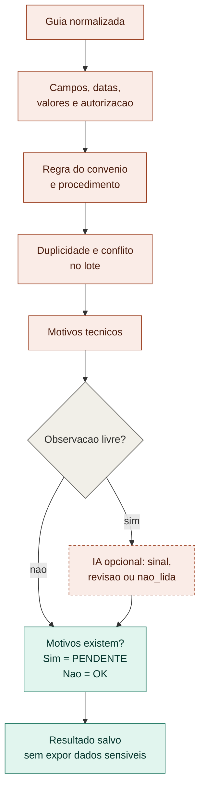
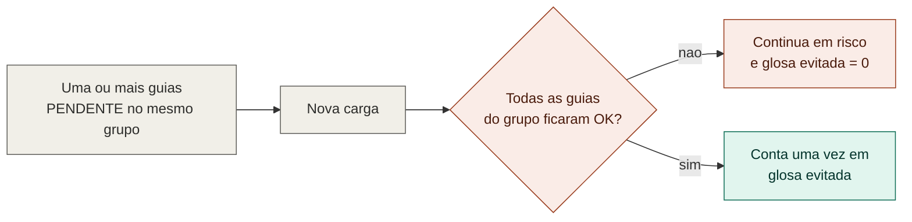
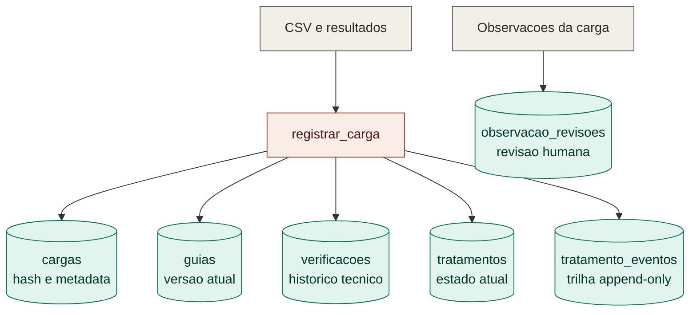
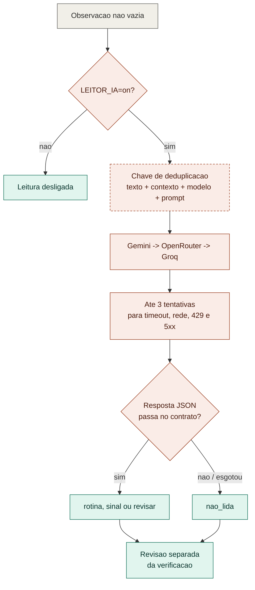

# Verificador de Guias V4

Projeto V4 da prova tecnica da Clinica Vitalis.

O mapa canonico para agentes e avaliadores esta em `docs/00-canonico/INDEX.md`; o contrato do produto entregue esta em `docs/00-canonico/STATUS-FINAL.md`.

## Objetivo

Conferir um arquivo de guias antes do envio ao convenio, mostrar o que precisa ser corrigido, acompanhar o trabalho da recepcao e permitir que a Carla e o Dr. Renato acompanhem o risco em tempo real.

## Arquitetura



As rotas fazem a leitura e a persistencia. O nucleo recebe somente dados, regras, modo e data de referencia; ele nao chama banco, rede ou modelo. O leitor de observacoes e um caminho lateral opcional: sua resposta e validada e registrada separadamente do resultado tecnico.

## Ciclo operacional



`Corrigi` apenas coloca o tratamento em `AGUARDANDO_REVERIFICACAO`. A guia sai da fila tecnica somente quando uma nova carga produz `OK` para o mesmo `id_guia`.

## Dados e contratos da prova

- `data/guias.csv`: 80 guias ficticias de agosto/2026.
- `data/guias-ajustadas.csv`: as mesmas 80 guias corrigidas para validar a reverificacao.
- `data/regras_convenio.json`: fonte unica das regras dos tres convenios.
- regras e contratos do nucleo deterministico: normalizacao, regras, datas, duplicidade e texto livre.
- contrato do MCP com `consultar_regra`, `verificar_guia` e `consultar_pendencias`.
- Skill `conferir-guia` para conferir uma guia e consultar a fila sem expor dados pessoais.

O codigo da aplicacao, do MCP e da Skill esta nesta pasta. Os dados ficticios vieram dos materiais da prova; a conferencia, a persistencia e a operacao foram implementadas para este fluxo. A camada de persistencia escolhe memoria local fora de producao ou Supabase no ambiente publicado.

## O que mudou no V4

- A entrada operacional principal e um upload de CSV.
- Sao tres areas: Carga de guias, Pendencias e Dashboard.
- Supabase guarda cargas, verificacoes e tratamento humano.
- `tratamento_eventos` guarda a trilha append-only de cada transicao, com lote, data e responsavel.
- Uma guia so sai da fila quando uma nova verificacao retorna `OK`.
- O check humano significa "corrigida na origem, aguardando reverificacao".
- Dashboard atualiza por polling a cada 5 segundos; nao depende de Realtime.
- O historico pode ser consultado em `/api/historico`, com filtros por periodo, guia, evento, responsavel e estado.
- Pendencias tem filtros avancados, exportacao CSV e tempo de resolucao.
- Dashboard tem graficos simples sem biblioteca adicional.
- O MCP ajuda a consultar regras, conferir uma guia e explicar a fila, mas nao fecha pendencias.

## Regra central

`status_verificacao` e independente de `status_tratamento`.

```text
PENDENTE + ABERTA = aparece em A fazer
PENDENTE + AGUARDANDO_REVERIFICACAO = aguarda novo CSV
OK + RESOLVIDA = sai da fila ativa
```

O clique manual nunca muda `PENDENTE` para `OK` e nunca reduz o valor em risco.

### Caminho da decisao



O resultado deterministico e fechado antes da leitura de texto. Uma observacao pode gerar uma revisao humana ou um codigo `TXT_*`, mas nao remove motivo, altera valor, libera cobertura ou converte uma guia para `OK`.

## Motor determinístico

O motor em `src/core` é a fonte da decisão técnica. Ele não acessa Supabase, não chama IA e não usa a data atual por conta própria: recebe a guia, as regras de `data/regras_convenio.json`, o modo e uma `data_referencia`. Cada critério gera um motivo técnico; se existir pelo menos um motivo, o resultado é `PENDENTE`. Avisos de formato não mudam o status.

### Critérios e recuperação

| Grupo | Códigos principais | O que significa | O que pode recuperar |
| --- | --- | --- | --- |
| Dados ilegíveis | `DADO_ILEGIVEL` | Data, valor, sessão ou limite ausente/inválido | Corrigir o dado na origem e reenviar |
| Campo obrigatório | `CAMPO_OBRIGATORIO_VAZIO` | Campo exigido pelo convênio não informado | Preencher o campo real e reenviar |
| Descrição | `DESCRICAO_DIVERGENTE` | Descrição não corresponde ao procedimento cadastrado | Corrigir a descrição, sem trocar o procedimento realizado |
| Cobertura | `PROCEDIMENTO_NAO_COBERTO` | O procedimento não está coberto pelo convênio | Decisão externa: particular ou não faturar pelo convênio |
| Procedimento desconhecido | `PROCEDIMENTO_DESCONHECIDO` | Código não existe nas regras | Confirmar código real antes do faturamento |
| Valor | `VALOR_DIVERGENTE` | Valor diferente da referência do procedimento | Conferir tabela e autorização; não alterar para mascarar |
| Autorização vencida | `AUT_VENCIDA` | Validade anterior à data real do atendimento | Só autorização nova e real que cubra a data |
| Validade excessiva | `VALIDADE_ACIMA_DO_MAXIMO` | Autorização ultrapassa o máximo do convênio | Corrigir com documento válido do convênio |
| Sessão sem cobertura | `SESSAO_ACIMA_DO_LIMITE` | Sessão excede o limite da autorização/convênio | Nova autorização real; sem ela, é risco de glosa |
| Limite divergente | `LIMITE_DIVERGENTE` | Limite informado difere da regra do convênio | Conferir com o convênio antes de enviar |
| Datas | `DATA_ATENDIMENTO_FUTURA`, `LANCAMENTO_ANTES_DO_ATENDIMENTO`, `PRAZO_ENVIO_VENCIDO` | Inconsistência temporal ou prazo expirado na referência informada | Corrigir somente o dado verdadeiro ou decidir com o convênio |
| Duplicidade | `DUPLICADA` | Mesma sessão lançada mais de uma vez com a mesma autorização | Manter uma guia e cancelar a outra antes do envio; não é automaticamente glosa |
| Conflito | `CONFLITO_AUTORIZACAO` | Mesma sessão associada a autorizações diferentes | Financeiro decide qual autorização é válida; não é automaticamente glosa |
| Texto livre | `TXT_*` | A observação indica autorização nova, autorização verbal, remarcação, particular ou procedimento diferente | Confirmar na origem; o texto nunca apaga um motivo determinístico |

### Risco e glosa

`valor_em_risco` inclui todas as guias `PENDENTE`, com deduplicação financeira por paciente, data de atendimento e procedimento. Já `glosa_nao_recuperavel` é um subconjunto conservador: considera autorização vencida, sessão acima do limite, procedimento não coberto e procedimento realizado diferente da autorização. Duplicidade, conflito de autorização e decisão de cobrança particular aparecem como pendências e exigem tratamento, mas não são classificados automaticamente como glosa.

Uma carga ajustada só recupera o que realmente mudou. Apagar uma observação não corrige procedimento realizado diferente, autorização vencida ou sessão extra; esses motivos continuam visíveis na fila e no dashboard.

`glosa_evitada` só cresce quando todas as guias pendentes de uma mesma exposição ficam `OK` na nova carga. Se o grupo continua parcialmente pendente, o risco permanece e nada é contabilizado como evitado.

Na fila operacional, a mesma regra aparece em tres leituras visuais:

| Classificacao | Tratamento |
| --- | --- |
| `Risco: glosa não recuperável` | Bloqueio técnico ou de cobertura que não é liberado editando apenas o CSV. |
| `Risco potencialmente recuperável` | Dado ou cadastro que pode ser corrigido e submetido novamente à verificação. |
| `Decisão antes do envio` | Duplicidade, conflito de autorização ou escolha de faturamento; não é glosa automática. |

### Fechamento de uma exposição



## Paginas

### `/`

Upload de CSV, carga da demonstracao, resultado do lote, contadores e exportacao.

### `/pendencias`

Fila operacional com motivo, campo, acao, responsavel, classificacao visual de risco, filtros, check de tratamento e exportacao do recorte atual.

### `/dashboard`

Guias verificadas, OK, pendentes, valor em risco, risco de glosa não recuperável, glosa evitada, tratamento, aguardando reverificação, gráficos e última carga. O filtro por convênio afeta o dashboard; o PDF continua sendo o resumo geral do período.

### Endpoints principais

| Endpoint | Funcao |
| --- | --- |
| `POST /api/lote` | Recebe CSV, calcula hash, verifica e persiste uma carga. |
| `GET /api/pendencias` | Lista a fila tecnica com filtros operacionais. |
| `POST /api/pendencias/:id` | Registra a correcao na origem como aguardando reverificacao. |
| `GET /api/dashboard` | Calcula indicadores do periodo e filtro opcional de convenio. |
| `GET /api/relatorio` | Entrega o relatorio textual geral do periodo. |
| `GET /api/relatorio/pdf` | Gera o PDF executivo geral, sem herdar filtros do dashboard. |
| `GET /api/revisoes` | Lista revisoes de observacoes. |
| `POST /api/revisoes/:id` | Resolve uma revisao humana sem alterar a verificacao tecnica. |
| `POST /api/mcp` | Expõe as ferramentas MCP autenticadas. |

## Como executar

```bash
npm ci
npm run dev
npm test
npm run lint
npm run typecheck
npm run build
```

Para Supabase no servidor, configure `SUPABASE_URL` e `SUPABASE_SERVICE_ROLE_KEY`, aplique `db/schema.sql` e mantenha a chave somente no ambiente do servidor. O navegador nao acessa o banco diretamente. Em produção sem banco configurado, as rotas de dados respondem `503`.

## Como o banco Supabase funciona

O Supabase guarda o histórico persistente e o estado operacional da aplicação. O núcleo em `src/core` não acessa rede nem banco: as rotas recebem o CSV, executam a verificação determinística e entregam o resultado para `src/infra/store.ts`, que usa Supabase quando as variáveis estão configuradas.

### Fluxo de uma carga

1. `POST /api/lote` recebe o CSV e calcula o hash do arquivo.
2. O CSV é normalizado e cada guia passa pelo núcleo determinístico.
3. Com `LEITOR_IA=on`, as observações são processadas separadamente; a IA só acrescenta sinais ou solicita revisão.
4. A aplicação chama a RPC `public.registrar_carga`.
5. Se o `hash_arquivo` já existir em `cargas`, a carga é idempotente e não cria novas verificações.
6. Em uma carga nova, a RPC grava as guias atuais, as verificações técnicas e os eventos de tratamento.
7. `/pendencias`, `/dashboard`, `/revisoes` e os relatórios leem o estado persistido pelo mesmo store.

### Tabelas e view

| Objeto | Função |
| --- | --- |
| `cargas` | Uma linha por CSV recebido; o hash garante idempotência. |
| `guias` | Dados mais recentes de cada `id_guia`; é o estado atual mutável. |
| `verificacoes` | Resultado técnico de cada carga: `OK` ou `PENDENTE`; histórico append-only. |
| `tratamentos` | Estado operacional atual: `ABERTA`, `EM_TRATAMENTO`, `AGUARDANDO_REVERIFICACAO` ou `RESOLVIDA`. |
| `tratamento_eventos` | Histórico append-only das transições técnicas e operacionais. |
| `observacao_revisoes` | Revisões humanas de observações lidas ou não lidas pelo leitor de IA. |
| `ultima_verificacao` | View que seleciona a verificação mais recente de cada guia. |

`db/README.md` documenta o modelo completo. `db/schema.sql` contém tabelas, índices, view, RPC, triggers e permissões. `db/auditoria.sql` contém consultas somente leitura para conferir cargas, contagens, estados, integridade e eventos no projeto publicado.

### O que é persistido



`guias` e `tratamentos` representam o estado atual. `cargas`, `verificacoes` e `tratamento_eventos` preservam historico. A view `ultima_verificacao` escolhe o resultado mais recente por guia para as leituras operacionais.

### Estados e reverificação

O status técnico fica em `verificacoes.status` e não é alterado pelo operador. O clique de correção grava apenas `AGUARDANDO_REVERIFICACAO` em `tratamentos`. Quando o mesmo `id_guia` chega em uma nova carga:

- continua `EM_TRATAMENTO` se o resultado ainda for `PENDENTE`;
- muda para `RESOLVIDA` somente se a nova verificação for `OK`;
- uma guia resolvida que volta a falhar reabre como `ABERTA`.

Triggers impedem `UPDATE` e `DELETE` no histórico de `cargas`, `verificacoes` e `tratamento_eventos`. Apenas os dados atuais de `guias` e o tratamento corrente são atualizados.

### Segurança e fallback

- `SUPABASE_SERVICE_ROLE_KEY` é usada somente no servidor da Vercel.
- O navegador não acessa o Supabase diretamente.
- O schema habilita RLS e revoga acesso de `anon` e `authenticated`.
- A RPC `registrar_carga` só pode ser executada pelo papel de serviço.
- Sem Supabase configurado fora de produção, o store usa memória ou arquivo local ignorado pelo Git.
- Sem Supabase configurado em produção, as rotas de dados respondem `503`, sem fingir persistência.

### Auditoria

Com o projeto Supabase ligado na CLI e as credenciais apropriadas, execute:

```bash
npx supabase db query --linked --file db/auditoria.sql
```

As consultas não fazem `INSERT`, `UPDATE`, `DELETE`, `TRUNCATE`, `ALTER` ou `DROP`. Para reproduzir a demonstração, carregue primeiro `data/guias.csv` e depois `data/guias-ajustadas.csv`.

## MCP e Skill

O MCP esta em `src/app/api/mcp/route.ts` e usa `mcp-handler` com transporte HTTP.
As ferramentas sao:

- `consultar_regra`: recebe convenio e codigo do procedimento.
- `verificar_guia`: recebe os campos da guia e devolve `OK` ou `PENDENTE`.
- `consultar_pendencias`: lista os ajustes por responsavel, unidade ou convenio, ou detalha uma guia pelo `id_guia`.

Exemplo de configuracao para um cliente MCP HTTP:

```json
{
  "verificador-vitalis": {
    "url": "https://SEU-DOMINIO/api/mcp"
  }
}
```

Localmente, use `http://localhost:3000/api/mcp`. Em um cliente MCP HTTP, a URL publicada e `https://SEU-DOMINIO/api/mcp`.
O contrato da Skill esta em `skills/conferir-guia/SKILL.md` e os exemplos em `skills/conferir-guia/EXEMPLOS.md`.

Para instalar o MCP em um cliente que aceite servidores HTTP, adicione a URL acima como servidor remoto. O MCP nao recebe a `service_role`; a chave fica somente na Vercel e e usada pelas ferramentas no servidor.

## Como fiz

- Next.js, TypeScript e Supabase: mantive a entrega pequena, com API no servidor e persistencia append-only.
- As regras deterministicas ficam no nucleo; IA nao decide cobertura, validade, valor ou prazo.
- Separei `status_verificacao` de `status_tratamento` para que o clique humano nunca transforme uma pendencia em guia OK.
- Usei polling em vez de Realtime porque as tabelas ficam sem leitura publica por RLS; assim o dashboard continua explicavel e seguro.
- O leitor de observacoes ficou opcional e desligado por padrao. Quando ativado, tenta Gemini, OpenRouter e Groq em cascata; sua resposta nao muda a decisao deterministica.
- O que ficou fora: escrita no sistema de gestao, WhatsApp, autenticacao de usuarios e cron de reverificacao. O CSV corrigido continua sendo a entrada operacional definida para a prova.

Para publicar na Vercel, configure `SUPABASE_URL` e `SUPABASE_SERVICE_ROLE_KEY` como variaveis de ambiente privadas, aplique `db/schema.sql` no projeto Supabase e execute a validacao manual descrita em `docs/03-operacao/TESTE-MCP-CLAUDE.md`.

### Ativar o leitor de observações

As chaves rodam somente no servidor e nunca vão para o navegador, CSV, MCP ou Git. Com `LEITOR_IA=on`, a ordem é Gemini, OpenRouter e Groq. Configure as chaves disponíveis como Secrets na Vercel; `OPENROUTER_MODEL` pode usar `openrouter/free` ou um modelo gratuito atual do catálogo. O leitor mascara CPF, telefone e e-mail antes do envio, usa temperatura zero, resposta JSON validada por Zod e retry; qualquer falha vira `nao_lida` e não altera a decisão determinística.

O contrato da resposta e estrito:

```json
{
  "classe": "rotina | sinal | revisar",
  "sinais": [],
  "motivo": ""
}
```

Os sinais permitidos sao `TXT_AUTORIZACAO_NOVA_NAO_LANCADA`, `TXT_AUTORIZACAO_VERBAL`, `TXT_SESSAO_REMARCADA`, `TXT_FATURAR_PARTICULAR` e `TXT_PROCEDIMENTO_DIFERENTE`. A classe `sinal` exige codigo; `rotina` nao pode ter motivo; `revisar` exige motivo; o motivo e limitado a 140 caracteres.



No lote, no maximo dois trabalhos rodam em paralelo e a etapa possui orçamento total de 45 segundos. Leituras iguais dentro da mesma carga compartilham o mesmo trabalho. Se o orçamento termina ou todos os provedores falham, o resultado vira `nao_lida`; a guia continua submetida somente aos motivos determinísticos.

## Como testei

- `npm.cmd test`: 33 testes passando em 10 arquivos.
- `npm.cmd run typecheck`: passando.
- `npm.cmd run build`: passando.
- Golden: 80 guias, 41 OK, 39 pendentes, R$ 2.664,00 em risco.
- Golden ajustado: 80 guias, 49 OK, 31 pendentes e R$ 2.116,00 em risco; bloqueios de glosa permanecem visíveis e a fila diferencia risco não recuperável, risco potencialmente recuperável e decisão pré-envio.
- MCP: `initialize` e `tools/list` respondem com as tres ferramentas.
- Privacidade: fila e CSV não retornam paciente, carteirinha, CID ou observação.
- Testes herméticos: a suíte usa `VITALIS_STORE_FILE=memory` e carrega o demo em cada teste.

## Limites honestos

- O V4 nao escreve no sistema de gestao da clinica.
- A recepcao precisa exportar e carregar o CSV corrigido.
- O MCP e assistivo; a web e a fonte de controle operacional.
- `consultar_pendencias` usa a fila local atual; a leitura paginada no Supabase ainda precisa de validação de integração.
- O arquivo local é um fallback de desenvolvimento; em produção a ausência do Supabase é erro `503`.
- Reenviar um arquivo idêntico a uma carga antiga não restaura o estado daquela carga; o hash é idempotente.
- A publicacao depende de um dominio e das variaveis de ambiente da infraestrutura escolhida.
- Os dados da prova sao ficticios; uso real exige autenticacao, RLS revisada e validacao LGPD.
